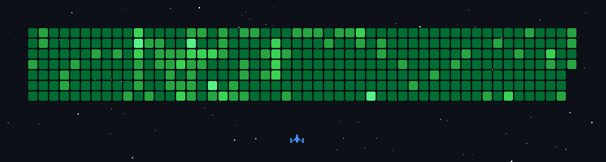

<!-- Generated by scripts/build_profile.py. Animated SVGs live in ./assets. -->

## Projects

| Project | What it does | Highlights | Language | Repository |
| --- | --- | --- | --- | --- |
| **QuickFix** | AI-powered troubleshooting platform that helps users identify technical problems and provides actionable, step-by-step solutions. | AI troubleshooting · step-by-step fixes | Python | [customer-complaint-agent_new](https://github.com/RiteshKumar2e/customer-complaint-agent_new) |
| **Steel Defect Detection** | Deep-learning computer vision system for detecting and classifying surface defects in steel using CNNs, MobileNetV2, FPN, and attention-based feature processing. | CNNs · MobileNetV2 · FPN · attention | Jupyter Notebook | [Steel_Surface_Defect_NEU_DET-DATASET](https://github.com/RiteshKumar2e/Steel_Surface_Defect_NEU_DET-DATASET) |
| **Community AI** | AI-powered community platform that helps users connect, share knowledge, discover relevant information, and receive intelligent assistance. | Community knowledge · AI assistance | JavaScript | [Community-Empowering-2.0](https://github.com/RiteshKumar2e/Community-Empowering-2.0) |

Repository languages from the GitHub API, read 07 Oct 2026.

## GitHub activity

  

  

### Connect

- **LinkedIn:** [linkedin.com/in/riteshkumar-tech](https://linkedin.com/in/riteshkumar-tech)
- **GitHub:** [github.com/RiteshKumar2e](https://github.com/RiteshKumar2e)
- **Email:** [riteshkumar90359@gmail.com](mailto:riteshkumar90359@gmail.com)
- **Portfolio:** [riteshkr.info](https://riteshkr.info)

<a href="https://linkedin.com/in/riteshkumar-tech">LinkedIn</a> &nbsp;·&nbsp; <a href="https://github.com/RiteshKumar2e">GitHub</a> &nbsp;·&nbsp; <a href="mailto:riteshkumar90359@gmail.com">Email</a> &nbsp;·&nbsp; <a href="https://riteshkr.info">Portfolio</a>

